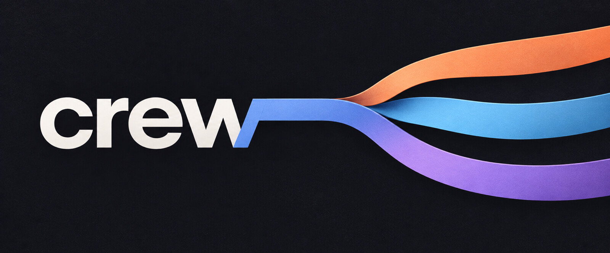
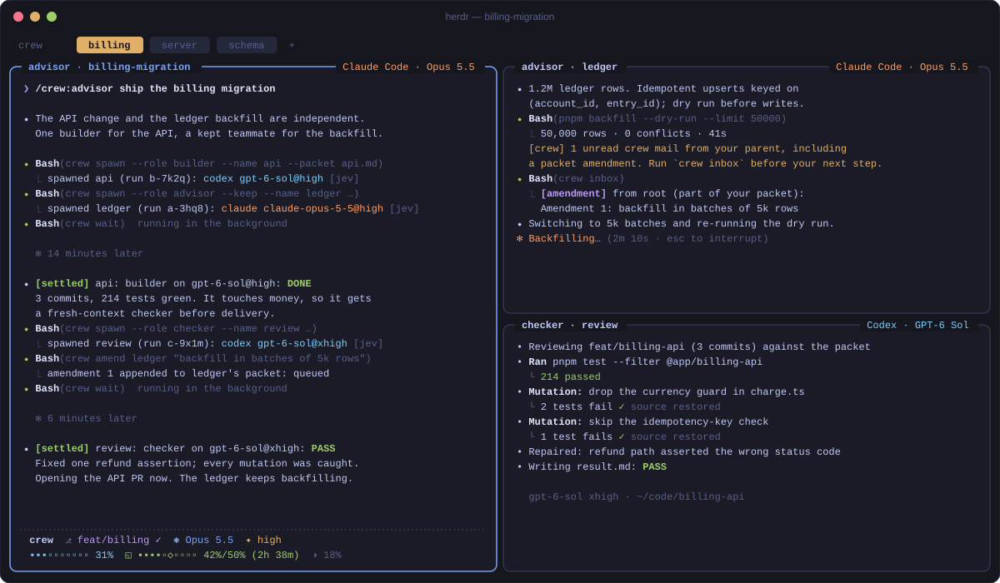
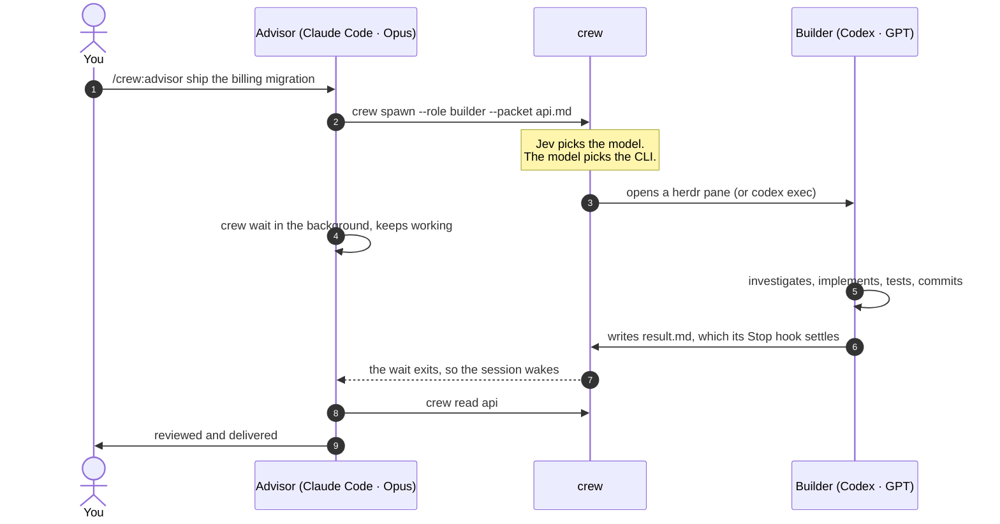

<p align="center">
  
</p>

<p align="center">
  <b>Run an engineering team of AI coding agents across Claude Code and Codex.</b><br>
  An advisor leads. Builders, checkers and teammates run on whichever CLI their model needs,<br>
  and they spawn, wake and message each other natively. No server, no database, no dependencies.
</p>

<p align="center">
  <a href="https://github.com/nourhelmi/crew/actions/workflows/test.yml"></a>
  <a href="LICENSE"></a>
  
  
  
  
</p>

<p align="center">
  <a href="#quickstart">Quickstart</a> ·
  <a href="#how-it-works">How it works</a> ·
  <a href="#the-team">The team</a> ·
  <a href="#commands">Commands</a> ·
  <a href="#routing">Routing</a> ·
  <a href="#configuration">Configuration</a> ·
  <a href="#faq">FAQ</a>
</p>

<br>

<p align="center">
  
</p>

## Why crew

Claude Code and Codex each run *one* agent very well. Real work wants a team: a lead who plans
and reviews, makers who build in parallel, a fresh pair of eyes before anything ships, and the
right model for each job, whichever lab made it.

The usual answer is an orchestration runtime: a scheduler, leases, a database, a daemon. Then the
runtime becomes the product. crew goes the other way, because the harnesses already have almost
everything:

- **Claude Code** re-invokes an idle session when a background command exits, and has subagents, hooks and plugins.
- **Codex** has subagents, hooks, plugins, and `codex queue`, which starts a turn in an idle thread.
- **herdr** gives every agent a visible pane with lifecycle state.

What's missing is the glue *between* hosts. crew is that glue: about 1,700 lines of
dependency-free TypeScript and a few plain files in `~/.crew`.

| | |
|---|---|
| **Cross-host, both directions** | A Claude advisor can staff a Codex builder, and a Codex root can staff Claude. |
| **The model picks the CLI** | Jev routes each role to a model: Anthropic models run in Claude Code, OpenAI models in Codex. Or pin one. |
| **Native wake, no polling** | Children settle through hooks. Parents wake the way their host already wakes. |
| **Teams that talk** | Kept teammates message each other and the lead, whichever CLI each one runs on. |
| **Visible by default** | In herdr, every agent is a named pane that splits away from its parent and closes when it's done. |
| **Plain files** | State is JSON you can `cat`. Races are settled by exclusive-create claim files. |

## Quickstart

```sh
git clone https://github.com/nourhelmi/crew ~/crew && cd ~/crew
node scripts/install.ts
```

Then, in any repository:

| | Claude Code (CLI or desktop) | Codex (CLI or app) |
|---|---|---|
| Lead a workstream | `/crew:advisor ship the billing migration` | `$advisor ship the billing migration` |
| Run a standing team | `/crew:cos …` | `$cos …` |
| Set up your models | `/crew:roster` | `$roster` |
| Routing on or off | `/crew:router off` | `$router off` |

The advisor decides what to do itself and what to delegate. Inside [herdr](https://herdr.dev) its
crew appears in panes beside it; anywhere else, children run as `claude --bg` sessions and
`codex exec` runs.

**Requirements:** macOS or Linux, Node.js ≥ 24 (crew runs its TypeScript directly), and
[Claude Code](https://code.claude.com) and/or the [Codex CLI](https://github.com/openai/codex),
logged in. Optional: [herdr](https://herdr.dev) for visible panes, and
[agent-router](https://github.com/nourhelmi/agent-router) for task-fit model routing with
[TypeSafe](https://typesafe.ai)'s Jev.

<details>
<summary><b>What the installer does</b></summary>

The installer is idempotent, and it backs up every file it touches to `~/.crew/backups/`. It:

- links `~/.local/bin/crew`
- installs the `crew` plugin into Claude Code and Codex, using this repo as a local marketplace
- links the Codex `advisor-maker` role
- pre-approves `crew` in Codex (`~/.codex/rules/crew.rules`) and makes `~/.crew` writable in its sandbox
- removes `CLAUDE_CODE_DISABLE_BACKGROUND_TASKS` from Claude settings, since background tasks are how Claude parents wake

Codex asks you once to review crew's hooks (`/hooks`, then trust). The hook commands are
version-stable, so upgrades don't ask again.

**`--trust-root <dir>`** (opt-in, repeatable): neither CLI inherits folder trust across git roots,
so a new checkout or worktree shows a trust dialog, and that dialog silently blocks a spawned
agent. With a trust root, crew trusts every checkout under it in both CLIs, adds `claude`/`codex`
shell wrappers for new ones, and re-sweeps every 10 minutes (launchd). Only point it at code you trust.

> In Claude Code, `/advisor` on its own is a built-in command. Use `/crew:advisor`.

</details>

## How it works



Five primitives, each built on something the hosts already do:

| Primitive | How crew does it |
|---|---|
| **Spawn** | `crew spawn` picks a model (pinned, routed, or the role default), and the model's provider picks the CLI. The child gets a packet (its assignment) and a result path. |
| **Wake** | The child writes `result.md` and its Stop hook settles it to the parent, which wakes the way its host does (table below). The parent's sweep is the backstop for a child whose hook never ran. |
| **Message** | `crew msg` writes to a file inbox (the source of truth), then pushes a one-line pointer: one per unread batch, so nothing stale is replayed. A busy child hears about new mail after its next tool call. |
| **Amend** | Children treat messages as advice. `crew amend` changes a child's scope, authority or done-when by appending to its packet. |
| **Watch** | Each parent gets one detached watcher. Whenever no `crew wait` is running, it catches children stuck on a dialog or gone without a result, and results no hook reported. It exits when no child is live. |

| When the parent is… | …it wakes because |
|---|---|
| a Claude Code session | its background `crew wait` exits, and Claude Code re-invokes the session |
| a Codex session | `codex queue` starts a turn in its thread with a one-line pointer |
| an idle agent in a herdr pane | the same pointer is typed into the pane |
| busy mid-turn | a PostToolUse hook announces unread mail after its next tool call |

## The team

The skills carry the doctrine; crew only moves work between hosts.

- **Advisor.** The technical lead and outcome owner. Works directly first, delegates cohesive work
  with a short packet (goal, decided vs. suggested, edit boundary, done-when with a proving
  command), and keeps one checkpoint per workstream. Review depth follows consequence.
- **Builder.** Owns investigation, implementation, tests, commits and browser checks of the affected journeys, end to end.
- **Checker.** A fresh-context review that *repairs* in-scope findings and reports the state after repair.
- **Child advisor.** The same judgment, scoped to the parent's outcome. It may delegate further and must settle its children before returning.
- **CoS (chief of staff).** An additive overlay where kept child advisors act as teammates for the
  life of the workstream. They message each other and the root, whichever CLI each one runs on.

Every maker returns a `result.md` with `Status / Claims / Evidence / Files / Decisions / Remaining Risk`.
The first line under Status is `DONE`, `PASS`, `FAIL` or `BLOCKED: <reason>`. A kept teammate that
must end a turn mid-assignment writes `IN PROGRESS: <next step>`, which wakes no one.

## Commands

The advisor drives crew for you. By hand:

```sh
crew spawn --role builder --packet api.md --name api          # routed: the model picks the CLI
crew spawn --role checker --checks api --packet review.md        # its verdict on api's work teaches routing
crew spawn --role advisor --keep --name billing --packet p.md # a CoS teammate
crew wait                       # until a child settles, stalls or needs a dialog, or mail arrives
crew msg billing "…"            # follow-up or answer (advice)
crew amend billing "…"          # scope, authority, done-when or a new assignment: appended to its packet
crew grade api bad "missed the migration"                      # your verdict; routing learns from it
crew inbox · crew ls · crew read api · crew stop api
crew route --role builder --task "…"                           # where would this go?
crew router off                 # this session and its children (see Routing)
```

In Claude Code, run `crew wait` as a **background** command: its exit wakes the session. In Codex,
settlements, mail and dialog notices are pushed into your thread, so keep working or end your turn.

## Routing

`crew spawn` without `--model` asks the configured router with `route --file - --dry-run` and the
payload `{ role, task, harness: "native" }`, then reads `selected.model` and `selected.thinking`.
It uses [agent-router](https://github.com/nourhelmi/agent-router) by default, and any command that
follows that contract works. If no router is installed or it fails, spawn uses the role defaults.

### Your roster

The roster is the list of models you can run, per role, in preference order, with what each one
is for and what it costs you. It lives in `~/.config/crew/roster.json`, and `crew roster` shows it
with each model's track record. The `roster` skill (`/crew:roster`, `$roster`) builds one with you:
it asks what subscriptions you have and what you think of the models, drafts the entries, and tries
them on your real tasks with `crew route` until the picks look right.

```json
{ "models": [
  { "model": "codex/gpt-6-sol", "effort": "high", "roles": ["advisor", "builder"], "cost": 0.15,
    "about": "the workhorse",
    "use": "implementation whose approach is clear; lanes that execute a known plan",
    "avoid": "open product or architecture decisions" },
  { "model": "claude/claude-opus-5-5", "effort": "high", "roles": ["advisor", "builder"], "cost": 1,
    "use": "lanes whose hard part is deciding what to build; greenfield UX",
    "avoid": "work whose approach is already decided; review" }
] }
```

- **`cost`** runs from 0 to 1 and is the share of your limits one assignment burns. A small plan
  makes its models dearer. On near-ties the router picks the cheaper model.
- **`use`** and **`avoid`** are what the router judges fit on. Always say what a model is worse at:
  if every entry sounds good at everything, the router can't tell them apart.
- **Without a router**, each spawn takes the first model per role. **With
  [agent-router](https://github.com/nourhelmi/agent-router)**, run `agent-router roster use --file
  ~/.config/crew/roster.json` (or `agent-router init --roster …`) and it routes from the same file.

| Model id | Runs in |
|---|---|
| `claude/…`, `anthropic/…`, `claude-bridge/…`, `claude-*`, `opus`, `sonnet` | **Claude Code** |
| `codex/…`, `openai/…`, `openai-codex/…`, `gpt-*` | **Codex** |
| `opencode/<provider>/<model>`, e.g. `opencode/opencode-go/kimi-k3` | **OpenCode** (experimental) |

Efforts a CLI lacks are clamped to the nearest one it has (Claude Code has no `minimal`).

| To turn routing off… | Run | Applies to |
|---|---|---|
| inside a session | `/crew:router off` (Claude Code), `$router off` (Codex) | that session and every child it spawns |
| from a terminal, before launching | `crew router off` | every session started from that shell, until it exits |
| for one launch | `CREW_ROUTER=off claude` | that launch; beats every other setting |
| everywhere | `crew router off --global` | the config |

With routing off, spawns use the role `defaults`, and `--model` still pins.

### Routing learns

A maker's own DONE says little, so crew learns from reviewed verdicts instead:

- **A checker's verdict.** A checker spawned with `--checks <run>` adds `As found: HELD`, `FIXED` or
  `BROKEN` under its status, judging that run's work before its own repairs. HELD counts for that
  run's model in its role; FIXED and BROKEN count against it.
- **The parent's grade.** `crew grade <run> good|bad "<why>"` records the parent's verdict on any
  child, including checkers and child advisors. Agents grade only their own children; you can grade
  any run from a plain terminal. Grading a run again replaces the earlier grade.

Every outcome is appended to `~/.crew/outcomes.jsonl` and sent to the router's `outcomes record`.
agent-router keeps a per-model, per-role track record that fades with age and shifts task fit once
evidence builds up (`agent-router outcomes stats` shows it). The advisor skill does both steps as
part of normal review.

## Configuration

`~/.config/crew/config.json`:

```json
{
  "defaults": { "advisor": "claude-opus-5-5@high", "builder": "gpt-6-sol@high", "checker": "gpt-6-sol@xhigh" },
  "router":   { "enabled": true, "command": "agent-router", "timeoutMs": 90000 },
  "args":     { "claude": ["--permission-mode", "auto"], "codex": [] },
  "trust":    { "roots": [] },
  "capacity": { "claude": { "max": 2, "overflow": "gpt-6-sol@high" } }
}
```

- **`defaults`** are the per-role models used when routing is off or fails. A role you leave out
  falls back to your roster's first launchable model for it, then to the built-in default.
- **`args`** are appended to every child of that host. Codex children otherwise inherit your Codex
  config (approvals and sandbox). crew never adds bypass flags; put them here if you want them.
- **`capacity`** (opt-in, empty by default) caps live crew runs per host. Every session on a host
  shares one subscription's rate limits, and a router that picks one spawn at a time can't see four
  Opus lanes burning the same 5-hour window. A routed spawn past the cap goes to the `overflow`
  model; a `--model` pin stays put, with a warning.

## Under the hood

- **State** is files: `~/.crew/runs/<id>/{meta.json, packet.md, result.md}` and
  `~/.crew/mail/<mailbox>/inbox.jsonl` with a read cursor. A child's hook and its parent's sweep
  race to report the same event; exclusive-create claim files pick one winner, and launchers merge
  into live metadata instead of overwriting it.
- **Identity:** crew children are their run id, Claude roots are `claude-<session id>`, and Codex
  roots are `codex-<thread id>`.
- **Sandboxes:** Codex's `workspace-write` keeps `.git` read-only, so spawn grants the checkout's git
  dir and `~/.crew` as writable roots, and builders commit without an escalation. Claude children
  get the same dirs, plus crew's skills, via `--add-dir`.
- **herdr:** every call is pinned to the session the run was spawned in, and agents are addressed by
  pane. Children split *away* from their parent: the first takes the right side, and each later
  one subdivides the newest child pane, so the parent keeps its column. Parallel spawns are
  serialized. Panes are named `role · name`, and finished children close their own pane.
- **Native subagents:** a Claude Code subagent can only run opus, sonnet, haiku or fable, and it
  inherits its parent's model by default. So inside a crew run, crew's hook refuses native
  subagents except the read-only `Explore` and `Plan`, and work goes through `crew spawn`, where it
  is routed, capped and graded. In the first sweep, Opus child advisors had run 60 native makers,
  every one on Opus. Codex children, whose native agents inherit Sol, are asked but not forced.
  To keep Claude's native subagents off Opus everywhere, set `CLAUDE_CODE_SUBAGENT_MODEL=sonnet` and
  `CLAUDE_CODE_SUBAGENT_MODEL_FORCE=1` in the `env` of `~/.claude/settings.json`. The variable
  alone misses `Explore` and `Plan`, which pin `inherit`.
- **Dialogs:** a child stuck on an approval, question or trust dialog wakes its parent with a
  `waiting` notice that says where to answer it.
- **Background tasks:** in Claude Code, children show up as a background task only while the
  parent holds `crew wait` as a background Bash command. `crew spawn` (and every `crew wait` that
  returns with children still live) says so and names them whenever nothing is waiting.
- **Compaction:** Claude Code and Codex keep a summary, not what a session read from files, so an
  advisor loses its workflow (a `/crew:cos` session keeps only a pointer to it) and a child its
  brief. On `SessionStart` with source `compact`, crew sends an advisor back to its skill and
  checkpoint, and a child back to its brief and packet, before the next prompt.
- **Prompt cache:** a parent idle past its cache's life pays to rewrite its whole context on wake
  (Claude Code keeps 1-hour entries; OpenAI's current models, 30 minutes). A read refreshes the
  timer, so a Claude root in `crew wait` stays warm through the wait's 30-minute timeout, and the
  watcher nudges any other idle parent just before expiry. It stops after a few hours of quiet,
  when one cold rewrite becomes cheaper than more nudges.
- **Codex's background server** keeps the working directory of whichever process started it, and a
  deleted worktree there breaks every Codex session. Spawn starts it from your home directory
  first. To recover by hand: `cd ~ && codex app-server daemon restart`.

## Battle-tested

crew's first real workout was a CoS team sweeping the test suite of a 180-workspace TypeScript
monorepo: 13 agent runs across both CLIs, 9 pull requests, every test deletion backed by a mutation
check. It also exposed exactly where the glue was weak: launch races, stale message replays, a
Codex root nobody was sweeping for, and five concurrent Opus sessions draining one 5-hour window.
Each became a fix and a test.

Verified end to end on Claude Code 2.1 and Codex 0.157:

- Claude ↔ Codex spawns in every direction, through herdr panes, `claude --bg` and `codex exec`
- a Codex root in herdr: spawn, push wakes, a `waiting` notice from the watcher, settle
- native background wake in Claude Code, and `codex queue` waking an idle Codex thread
- a busy child picking up a packet amendment mid-turn, in both CLIs
- a kept CoS teammate taking a second assignment

## FAQ

<details>
<summary><b>Why not just use subagents?</b></summary>

crew does, for same-host makers: Claude's `Agent` tool and Codex's `spawn_agent`, each with an
`advisor-maker` agent that can't stop before writing its result. Subagents can't cross to the other
CLI, though, and they aren't teammates you can see, message or keep for a whole workstream. crew
covers everything else.
</details>

<details>
<summary><b>Do I need herdr, Jev or agent-router?</b></summary>

No. Without herdr, children run as `claude --bg` sessions and `codex exec` runs. Without a router,
spawn uses the role defaults in your config, and `--model` always pins.
</details>

<details>
<summary><b>Does crew bypass permissions or sandboxes?</b></summary>

Never. It adds no bypass flags; children inherit your approvals and sandbox. The only things it
pre-approves are its own `crew` command in Codex, and the git dir and `~/.crew` as writable roots
for the children it launches.
</details>

<details>
<summary><b>What does it cost?</b></summary>

Nothing beyond the subscriptions you already have. crew makes no model calls of its own; the
optional router makes one small Jev call per routed spawn. Mind your rate-limit windows when you
run many lanes at once, which is what `capacity` is for.
</details>

<details>
<summary><b>What about OpenCode or other agent CLIs?</b></summary>

The design is host-agnostic. User entry points are [Agent Skills](https://agentskills.io), which
any compatible host loads, and a new host needs three things: a way to spawn with a first prompt, a
turn-end hook, and a way to wake an idle session. Contributions welcome.
</details>

## Limitations

- A message from Codex to an *idle* Claude session outside herdr waits for that session's next
  `crew wait` or turn. Claude Code "channels" could push it, but they're a research preview.
- A `codex exec` child can't take mail mid-run. Use herdr, or `--keep`, for anything you'll talk to.
- Hooks are the fast path and the parent's sweep is the backstop. Disable both and nothing settles.
- **OpenCode is experimental.** The installer adds crew's plugin (`opencode/crew.js`, standing in
  for the hooks), the skills, and `/advisor` `/cos` `/roster` `/router` commands. It's unit-tested,
  and the plugin loads in OpenCode 1.14, but no model turn has run through it end to end yet.
  OpenCode's TUI serves no port, so the plugin wakes its own session when crew mail lands.
- Claude children run with `--permission-mode auto` by default. A model without auto mode (Haiku,
  in testing) asks instead, and each prompt reaches the parent as a `waiting` notice.

## Contributing

```sh
npm install        # typescript, for the typecheck only
npm test && npm run typecheck
node scripts/install.ts   # after changing skills or hooks, bump `version` in both plugin manifests first
```

[AGENTS.md](AGENTS.md) lists the invariants: zero runtime dependencies, tests that never touch
your real Claude, Codex or herdr state, and user entry points as skills rather than host-specific
commands.

## License

[MIT](LICENSE) © Nour Helmi
